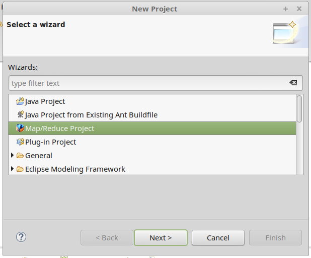
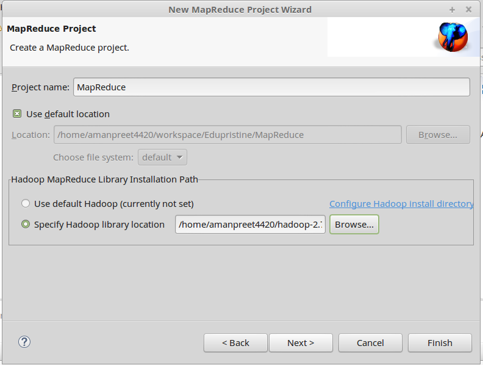
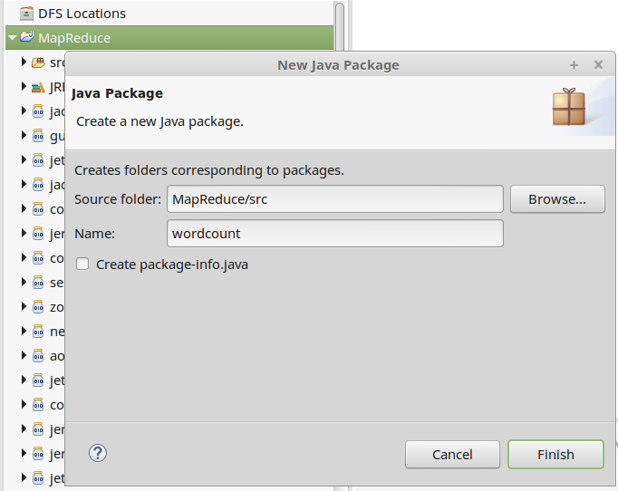
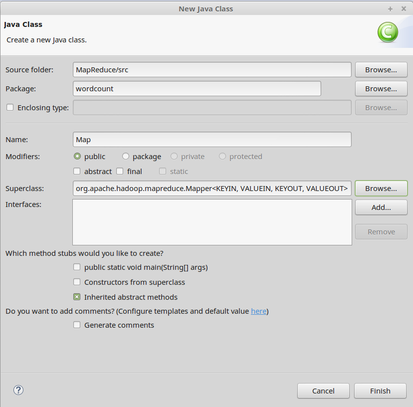
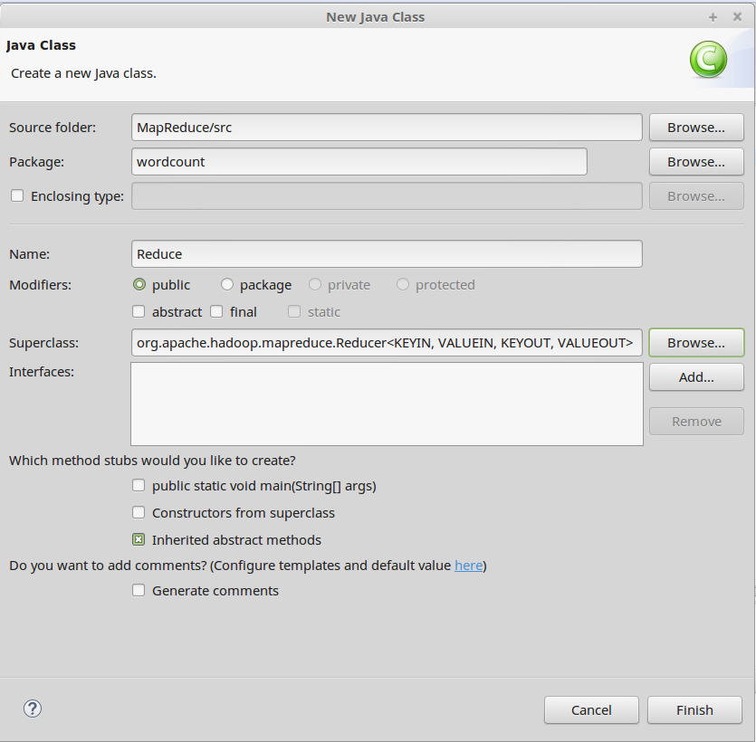
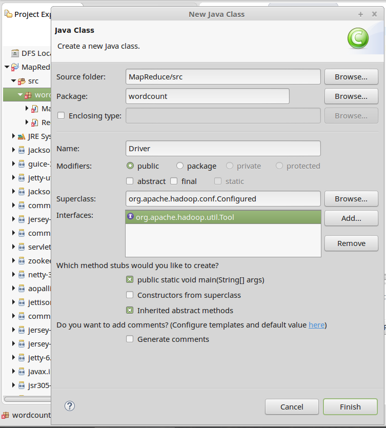
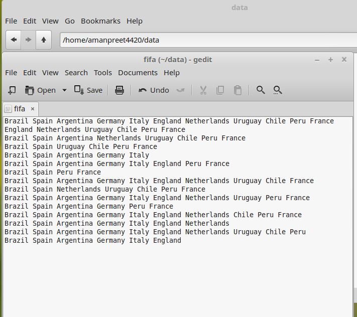
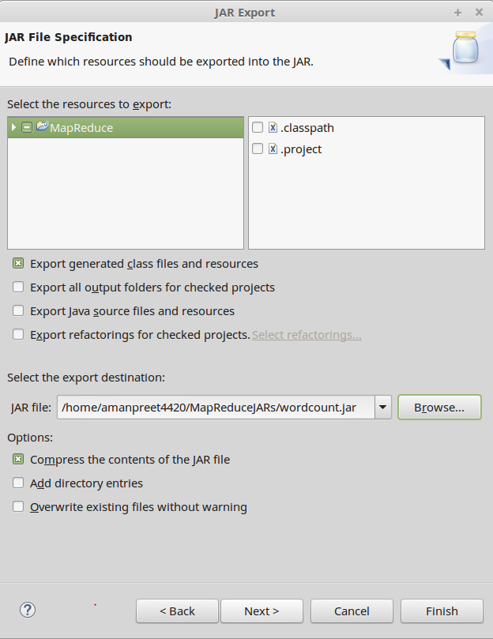
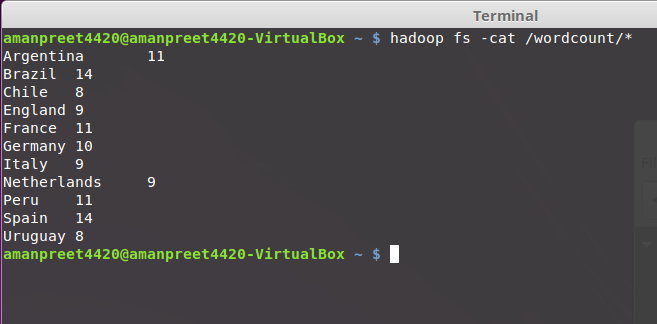

# MapReduce #

### Eclipse ###

We will be using *Eclipse Mars* for our MapReduce projects. Please download and setup Eclipse.

### Hadoop-eclipse-plugin-2.7.1.jar ###

For our MapReduce programs, we will need the base classes provided by Hadoop. This jar file contains the necessary base classes for our MapReduce program. We will need to put this jar file in the eclipse->plugins directory.

This file is located in the *MapReduce->Prerequisites* folder on GitHub

###### Figure 1 ######

## First MapReduce project ##

We will first create a bare-bone or bare minimum code for any MapReduce project.

- In eclipse, go to New Project and select *Map/reduce Project*

###### Figure 2 ######

- We will name the project *MapReduce* and *Specify Hadoop library location* to the location where we extracted Hadoop (*/home/amanpreet4420/hadoop-2.7.1*) and click *Finish*. Click Yes to the pop-up that comes.

###### Figure 3 ######

- Now we will create a package in the project. By selecting the *MapReduce* project, right-click *New->Package* and name *wordcount*

###### Figure 4 ######

- Now we will create a class in the package. By selecting the package *wordcount*, right-click *New->Class* and name it *Map*. In the Superclass, select *org.apache.hadoop.mapreduce.Mapper<KEYIN, VALUEIN, KEYOUT, VALUEOUT>*

	- This class will contain the Mapper code

###### Figure 5 ######

- We will create another class in the package. By selecting the package *wordcount*, right-click *New->Class* and name it *Reduce*. In the Superclass, select *org.apache.hadoop.mapreduce.Reducer<KEYIN, VALUEIN, KEYOUT, VALUEOUT>*.

	- This class will contain the Reducer code.

###### Figure 6 ######

- We will create another class in the package. By selecting the package *wordcount*, right-click *New->Class* and name it *Driver*. In the Superclass, select *org.apache.hadoop.conf.Configured*. In the Interfaces, select *org.apache.hadoop.util.Tool*. As this class will be the driver for our MapReduce program, we will select *public static void main(String[] args)* checkbox

	This will be the driver class for our MapReduce program. Also this class will contain the configuration for our MapReduce program. Here we will set the properties for the Job

###### Figure 7 ######

Now we have set up the bare minimum code required for any MapReduce project.

- Next is to set the properties for the Job in *Driver* class run method.
	- We will create a Singleton instance of the *Job* class, using

		> Job job = Job.getInstance();

	- We will set Job Name using *setJobByName* property. And we will set the *setJarByClass* property (we will use this property when we run the MapReduce job from Terminal).

		> job.setJobName("wordcount");
		
		> job.setJarByClass(getClass());

	- Next we will tell the code, which is our *Mapper* and *Reducer* class, using

		> job.setMapperClass(Map.class);
		
		> job.setReducerClass(Reduce.class);

- Here we will pause and consider our Use Case.
	- Let’s create a file *fifa* that will contain the unstructured data in each row. Contents of the file is below:

###### Figure 8 ######

	- Use Case
		- Count the number of times each country has appeared
		
- For our Use Case, we will be using *TextInputFormatter*. This is the default format for reading the text line-by-line and it creates a <key,value> pair. This <key,value> pair will be the input to Mapper. Mapper will take this <key,value> as input, runs custom business logic and outputs another set of <key,value> pairs

	- The <key,value> pair that TextInputFormatter outputs is like below:

		*<321156461, Brazil Spain Argentina Germany Italy England Netherlands Uruguay Chile Peru France>*

		where *321156461* is the key (this is some offset generated by the Formatter)
		and *Brazil Spain Argentina Germany Italy England Netherlands Uruguay Chile Peru France* is the value.

	- Mapper takes this input and generates output like below:

		>		<Brazil,1>
		>		<Spain,1>
		>		<Argentina,1>
		>		<Germany,1>
		>		<Italy,1>
		>		<England,1>
		>		<Netherlands,1>
		>		<Uruguay,1>
		>		<Chile,1>
		>		<Peru,1>
		>		<France,1>

- Now, let’s get back to our *Driver* class. In the *Driver* class run method, we will specify below properties:

	- Set the datatype of Key that Mapper outputs
	
		> job.setMapOutputKeyClass(Text.class);

	- Set the datatype of value that Mapper outputs
	
		> job.setMapOutputValueClass(IntWritable.class);
	 
	- Set the datatype of Key that Reducer outputs
	
		> job.setOutputKeyClass(Text.class);
		
	- Set the datatype of value that Reducer outputs
	
		> job.setOutputValueClass(LongWritable.class);
		
	- Set the type of InputFormat to use
	
		> job.setInputFormatClass(TextInputFormat.class);

	- Set the path of Input file to process

		> FileInputFormat.setInputPaths(job, new Path(arg0[0]));

	- Set the path of final Output

		> FileOutputFormat.setOutputPath(job, new Path(arg0[1]));

	- Wait for completion of the Job. 

		> return job.waitForCompletion(true) ? 1 : 0;

- In the *Driver* class *main* method, write below that will initiate the Job. ToolRunner.run() lets the hadoop application handle standard command line options.

	> ToolRunner.run(new Configuration(), new Driver(), args);

- Let’s get back to our *Map* class.
	- Change the placeholders as:
		- KEYIN to LongWritable
		- VALUEIN to Text
		- KEYOUT to Text
		- VALUEOUT to IntWritable
	- Add *map* method, see below:

		>     public void map(LongWritable key, Text value, Context context)
		>     {
		>     	try
		>     	{
		>     		
		>     	}
		>     	catch(Exception e)
		>     	{
		>     		System.out.println(e.getMessage());
		>     	}
		>     }
    
	- Based on our Use Case, we will split each word using *StringTokenizer* and write <key,value> to context. See below:

		>     public void map(LongWritable key, Text value, Context context)
		>     {
		>     	try
		>     	{
		>     		StringTokenizer token = new StringTokenizer(value.toString());
		>     		
		>     		while(token.hasMoreTokens())
		>     		{
		>     			context.write(new Text(token.nextToken()), new IntWritable(1));
		>     		}
		>     	}
		>     	catch(Exception e)
		>     	{
		>     		System.out.println(e.getMessage());
		>     	}
		>     }

- In between Map and Reduce, below happens
	- Partitioning and Shuffle
	- Sorting and Grouping
		- Here the input from the Mapper is grouped together based on the key, see below. This output goes to the *reduce* method
			
			<Italy,{1,1,1,1,1}>

- Now let’s go to the *Reduce* class.
	- Change the placeholders as:
		- KEYIN to Text
		- VALUEIN to IntWritable
		- KEYOUT to Text
		- VALUEOUT to LongWritable

	- Add reduce method, see below:

		>     public void reduce(Text key, Iterable<IntWritable> value, Context context)
		>     {
		>     	try
		>     	{
		>     		
		>     	}
		>     	catch(Exception e)
		>     	{
		>     		System.out.println(e.getMessage());
		>     	}
		>     }

	- Based on out Use Case, we will count each value in *values*. See below:

		>     public void reduce(Text key, Iterable<IntWritable> values, Context context)
		>     {
		>     	try
		>     	{
		>     		long count = 0L;
		>     		
		>     		for(IntWritable value : values)
		>     		{
		>     			count += value.get();
		>     		}
		>     		
		>     		context.write(key, new LongWritable(count));
		>     	}
		>     	catch(Exception e)
		>     	{
		>     		System.out.println(e.getMessage());
		>     	}
		>     }

- Now is the time to run our MapReduce program
	- Right-click on the package, *wordcount*, click Export
	- Select *JAR* file, select location where JAR file is stored and name the JAR file. Click *Finish* (see Figure 9 below)
	- Start the Hadoop services using 
		> /home/amanpreet4420/hadoop-2.7.1/sbin/start-all.sh.

	- Create a directory in HDFS using 
		> hadoop fs -mkdir /datafifa

	- Put the fifa file we creates earlier in HDFS using
		> hadoop fs -put /home/amanpreet4420/data/fifa /datafifa

	- Execute the MapReduce Job using
		> hadoop jar /home/amanpreet4420/MapReduceJARs/wordcount.jar wordcount.Driver /datafifa/fifa /wordcount  (see Figure 10 below)

		- */home/amanpreet4420/MapReduceJARs/wordcount.jar*: Location of jar file
		- *wordcount.Driver*: Package name and Driver class name, from here we set the value of property job.setJarByClass(getClass()) in the Driver class
		- */datafifa/fifa*: input for Job
		- */wordount*: output directory

	- After the Job is executed, see the output created in */wordcount*
		- _SUCCESS: this is a flag file, stating that the operation was successful
		- part-r-00000: this is the files containing the final output.
			- Note that there is just one file created, as the number of reducer is 1

	- Content of part-r-00000 file are below  (see Figure 11 below):

###### Figure 9 ######

###### Figure 10 ######

###### Figure 11 ######